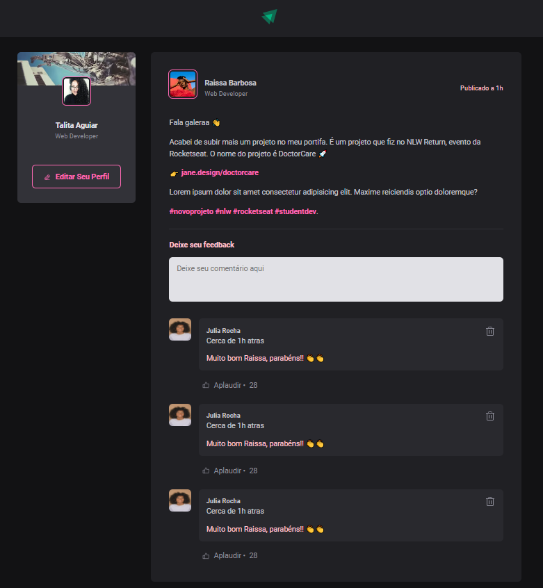

# React + Vite

This template provides a minimal setup to get React working in Vite with HMR and some ESLint rules.

Currently, two official plugins are available:

- [@vitejs/plugin-react](https://github.com/vitejs/vite-plugin-react/blob/main/packages/plugin-react/README.md) uses [Babel](https://babeljs.io/) for Fast Refresh
- [@vitejs/plugin-react-swc](https://github.com/vitejs/vite-plugin-react-swc) uses [SWC](https://swc.rs/) for Fast Refresh

## Sobre o desenvolvimento /Aprendizado

- Modulo 01 e 02:

* Propriedades;
* Bundlers;
* Componentização;
* Dependencias;
* Figma;
* Fundamentos;
* Compilers;
* Desestruturação de props;
* Iteração JSX;
* Calculos para aplicação de medidas responsivas;

Obs: imagens de profile retiradas de Unsplash; Icones Phosphor-react;
